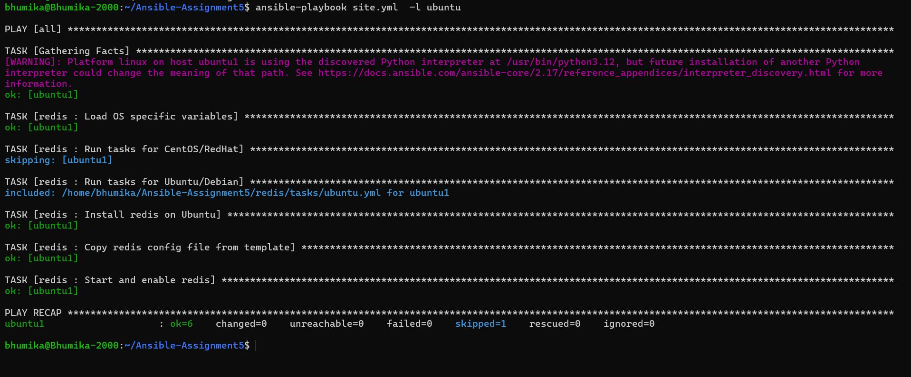
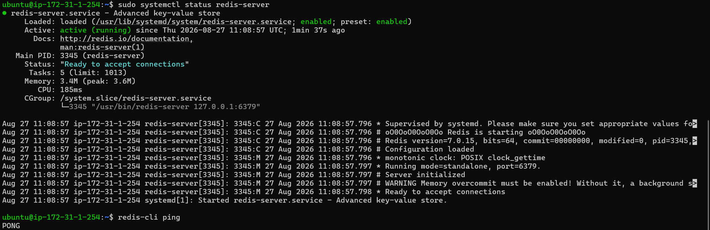
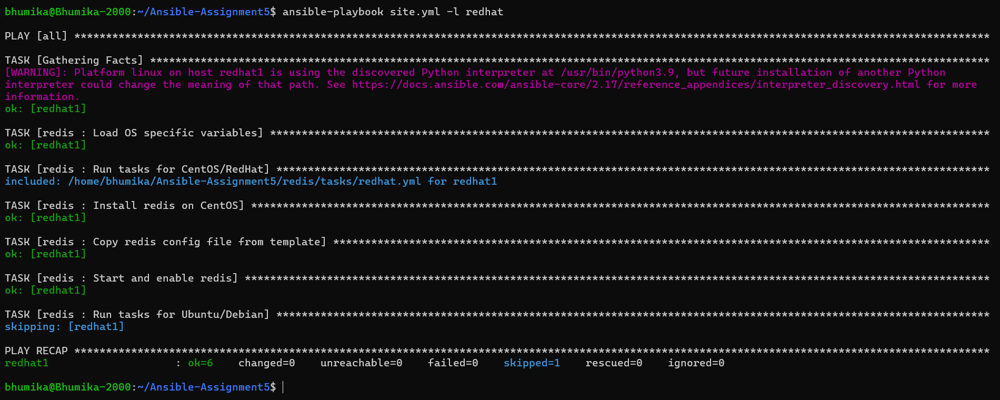
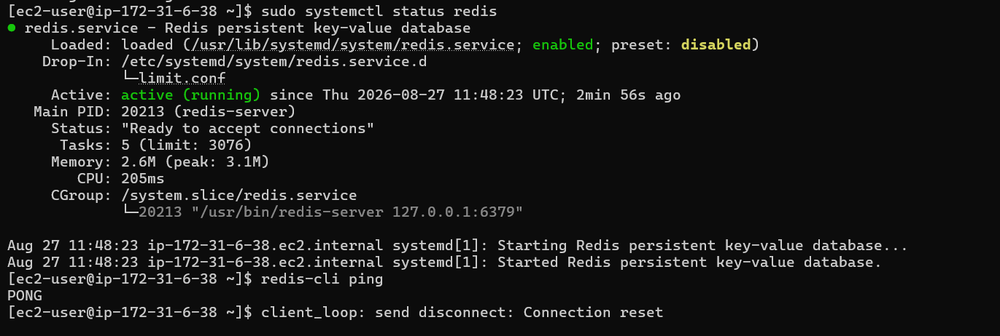

# Ansible Assignment 5

## Ansible Role

### Objective

Create an Ansible role for the assigned tool with the following features:

- Install a specific version of the tool
- Support different operating systems
- Keep configuration values variableized
- Use Jinja2 templates
- Manage configuration files using templates
- Use handlers separately from tasks
- Allow the role to run on CentOS, Ubuntu, or both

---

# Role Structure

```text
assignment-5/
│
├── inventory
├── playbook.yml
│
└── roles/
    └── tool_role/
        ├── tasks/
        │   └── main.yml
        ├── handlers/
        │   └── main.yml
        ├── templates/
        │   └── tool.conf.j2
        ├── defaults/
        │   └── main.yml
        └── vars/
            └── main.yml

```
# ubuntu installation





# redhat installation


